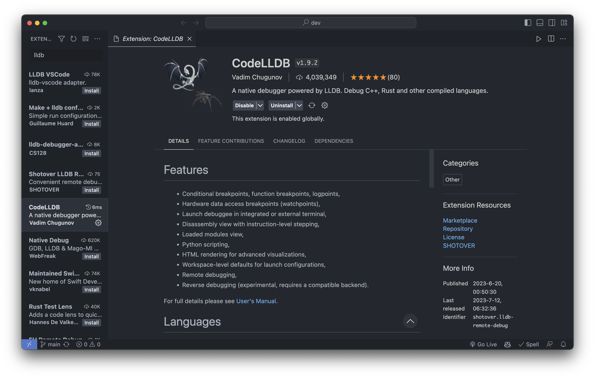

## LLDB

lldb는 apple에서 개발하고 있는 디버거이고 [gdb는 지원을 종료했다고 한다.](https://stackoverflow.com/questions/67310123/how-to-install-gdb-on-mac-m1-apple-silicon)

vscode의 default debugger는 gdb이기 때문에 [CodeLLDB](https://github.com/vadimcn/codelldb/blob/master/MANUAL.md)을 다운

- [ref](https://velog.io/@hye0n/Mac-%ED%99%98%EA%B2%BD-vscode-%EC%97%90%EC%84%9C-C%EC%96%B8%EC%96%B4-%EA%B0%9C%EB%B0%9C%ED%99%98%EA%B2%BD-%EC%84%B8%ED%8C%85-feat.%EB%94%94%EB%B2%84%EA%B9%85)

### lldb 많이 쓰는 명령어

```
po [expression] : print object
p [expression] : print
e [expression] : evaluate
fr v : frame variable
x [address] : memory dump
x/4b [address] : memory dump 4 bytes
x/4x [address] : memory dump 4 words
x/4i [address] : memory dump 4 instructions
x/4c [address] : memory dump 4 characters
x/4t [address] : memory dump 4 binary
x/4f [address] : memory dump 4 floats
x/4s [address] : memory dump 4 strings
x/4g [address] : memory dump 4 longs
x/4h [address] : memory dump 4 shorts
x/4L [address] : memory dump 4 long doubles
x/4a [address] : memory dump 4 addresses
x/4A [address] : memory dump 4 addresses
```
> watch 탭에서 변수의 값을 보려면 var,expression을 사용하면 된다.

- [cmd](https://lldb.llvm.org/use/map.html)
- [LLDB Tutorial](https://lldb.llvm.org/use/tutorial.html)
