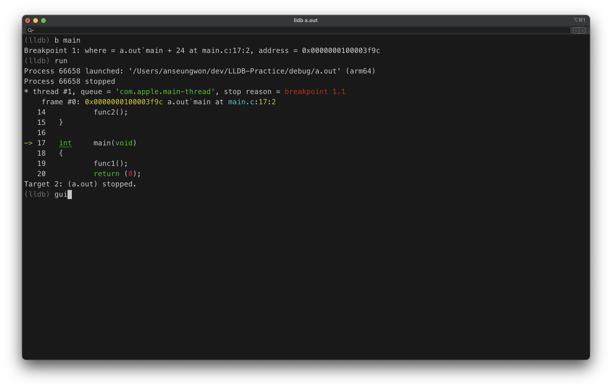
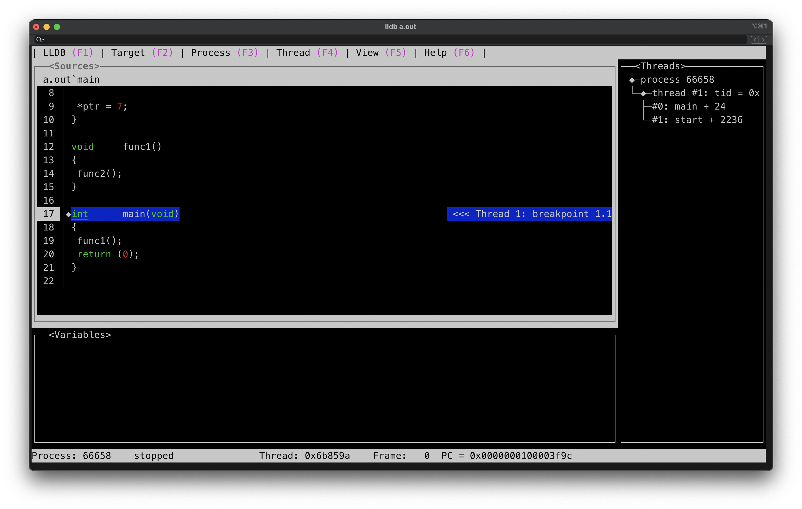
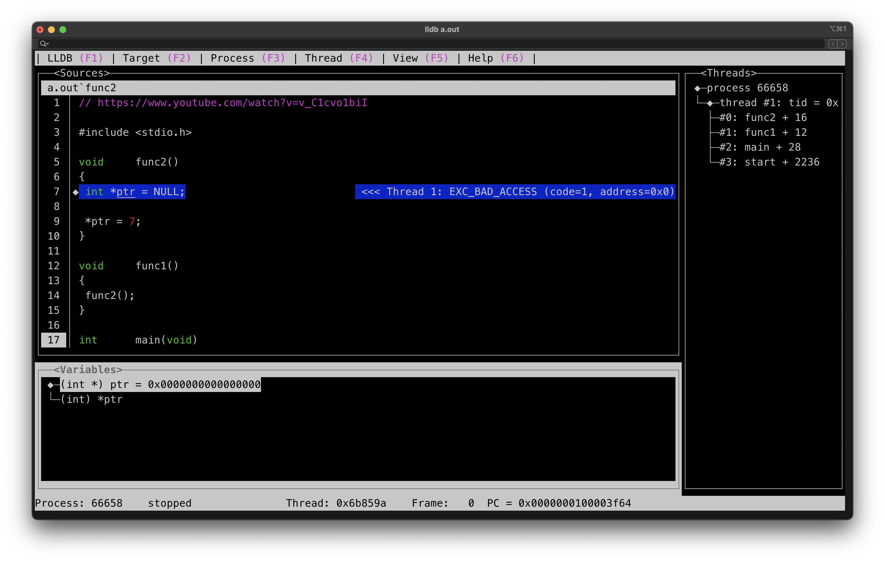
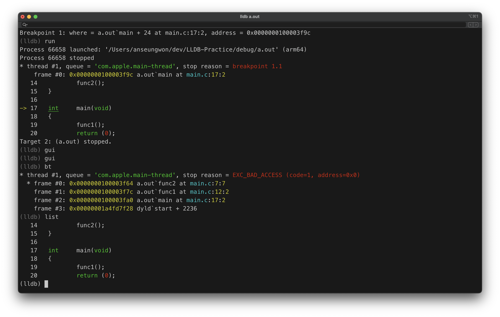

```shell
gcc -g main.c

lldb a.out

(lldb) run
Process 66340 launched: '/Users/anseungwon/dev/LLDB-Practice/debug/a.out' (arm64)
Process 66340 stopped
* thread #1, queue = 'com.apple.main-thread', stop reason = EXC_BAD_ACCESS (code=1, address=0x0)
    frame #0: 0x0000000100003f64 a.out`func2 at main.c:7:7
   4    {
   5            int *ptr = NULL;
   6
-> 7            *ptr = 7;
   8    }
   9
   10   void    func1()
Target 0: (a.out) stopped.

(lldb) target create a.out
Current executable set to '/Users/anseungwon/dev/LLDB-Practice/debug/a.out' (arm64).

(lldb) b main.c
Breakpoint 1: where = a.out`main + 24 at main.c:17:2, address = 0x0000000100003f9c

(lldb) r
Process 66394 launched: '/Users/anseungwon/dev/LLDB-Practice/debug/a.out' (arm64)
Process 66394 stopped
* thread #1, queue = 'com.apple.main-thread', stop reason = breakpoint 1.1
    frame #0: 0x0000000100003f9c a.out`main at main.c:17:2
   14
   15   int     main(void)
   16   {
-> 17           func1();
   18           return (0);
   19   }
Target 2: (a.out) stopped.

(lldb) list 10
   10   void    func1()
   11   {
   12           func2();
   13   }
   14
   15   int     main(void)
   16   {
   17           func1();
   18           return (0);
   19   }

   (lldb) s
Process 66394 stopped
* thread #1, queue = 'com.apple.main-thread', stop reason = EXC_BAD_ACCESS (code=1, address=0x0)
    frame #0: 0x0000000100003f64 a.out`func2 at main.c:7:7
   4
   5    void    func2()
   6    {
-> 7            int *ptr = NULL;
   8
   9            *ptr = 7;
   10   }
Target 2: (a.out) stopped.

(lldb) bt
* thread #1, queue = 'com.apple.main-thread', stop reason = EXC_BAD_ACCESS (code=1, address=0x0)
  * frame #0: 0x0000000100003f64 a.out`func2 at main.c:7:7
    frame #1: 0x0000000100003f7c a.out`func1 at main.c:12:2
    frame #2: 0x0000000100003fa0 a.out`main at main.c:17:2
    frame #3: 0x00000001a4fd7f28 dyld`start + 2236

(lldb) target create a.out
Current executable set to '/Users/anseungwon/dev/LLDB-Practice/debug/a.out' (arm64).
```




_tab, 방향키를 이용하여 변수의 값을 확인할 수 있다._

_bt(BackTracking)를 이용해 현재 콜스텍 등을 파악할 수 있다._
